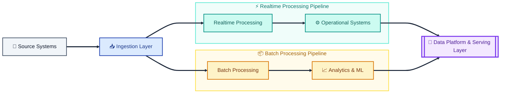

<div align="center"> # </div>
<div align="center">


<br/>


<br/><br/>


</div>

---

## ⚡ About Me

I’m a Senior Data Engineer focused on building hybrid data platforms that combine large-scale batch analytics with low-latency realtime systems.

Over the last 9+ years, I’ve worked across AWS and Azure designing distributed architectures for analytics, machine learning, realtime decisioning, operational intelligence, and event-driven platforms.

My work typically sits at the intersection of:

- analytics engineering & ML infrastructure
- streaming systems & realtime processing
- distributed data platforms
- observability, governance, and reliability
- platform engineering & operational scalability

I enjoy designing systems that remain understandable, reliable, and operationally simple as they scale.

---

## 🏗️ Architecture Mindset



---

## 🔄 Tech Ecosystem

### 💻 Languages & Core Platforms


### ⚡ Data Engineering & Orchestration


### 💾 Storage & Infrastructure


### 🧠 AI & Intelligent Tooling


### 🛠️ Development & CI/CD


---

## 🤖 AI-Assisted Data Engineering

Recently, I’ve been exploring AI-assisted data engineering and intelligent data applications using orchestration frameworks, LLM workflows, and structured extraction pipelines.

Built containerised workflows using Dagster, PostgreSQL, Docker Compose, LiteLLM, and Gemini APIs for automated classification, enrichment, and analytical processing of large-scale unstructured datasets.

Current areas of exploration include:

- LLM-assisted data workflows
- intelligent extraction pipelines
- orchestration-driven AI systems
- AI-ready data platforms
- scalable analytical enrichment systems

---

## 🧠 Engineering Philosophy

```python
while system.is_scaling():
    prioritize(reliability)
    reduce(complexity)
    improve(observability)
```

> Nothing humbles a data platform faster than an “optional” field in production.

---

## 📊 GitHub Analytics

<div align="center">


<br/><br/>


</div>

---

## 🏆 Trophies

<div align="center">


</div>

---

## 🤝 Connect

<div align="center">

<a href="mailto:krmuthakana@gmail.com">
  
</a>

<a href="https://github.com/KoushikMuthakana">
  
</a>

<a href="https://www.linkedin.com/in/YOUR_LINKEDIN/">
  
</a>

</div>

---

<div align="center">


</div>

